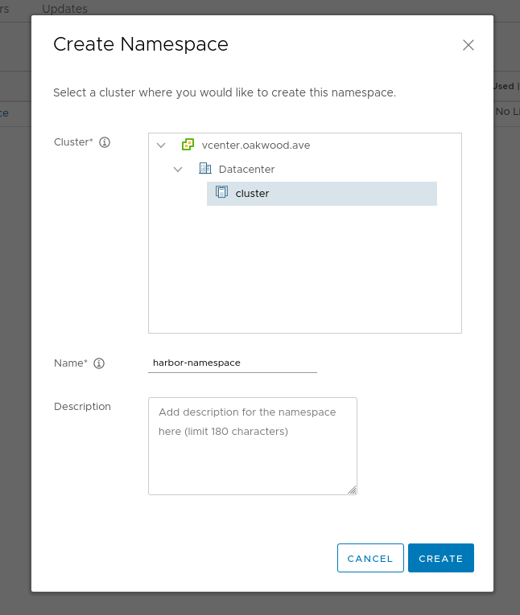
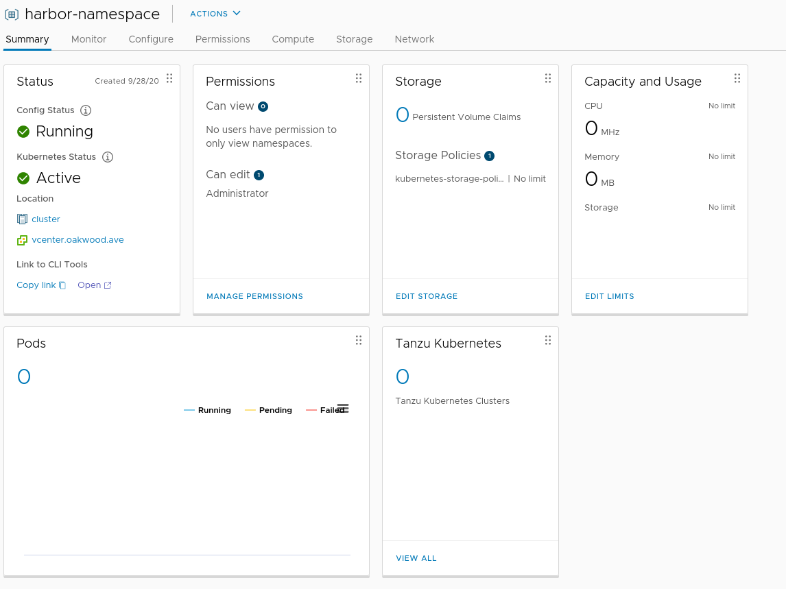
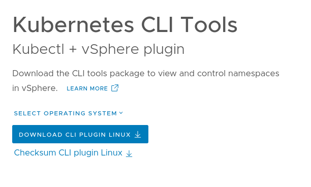
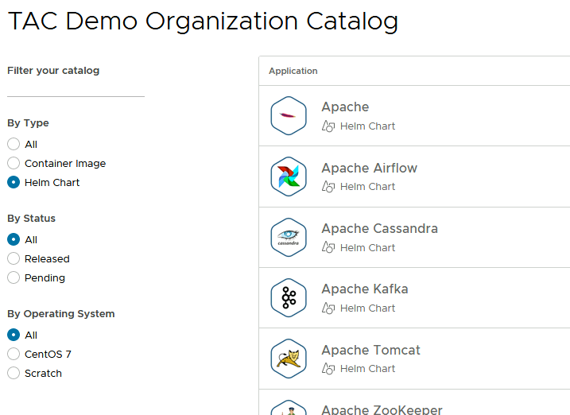
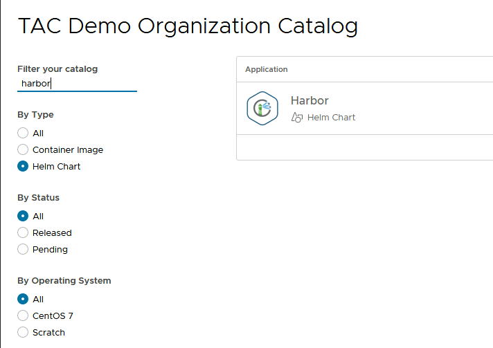
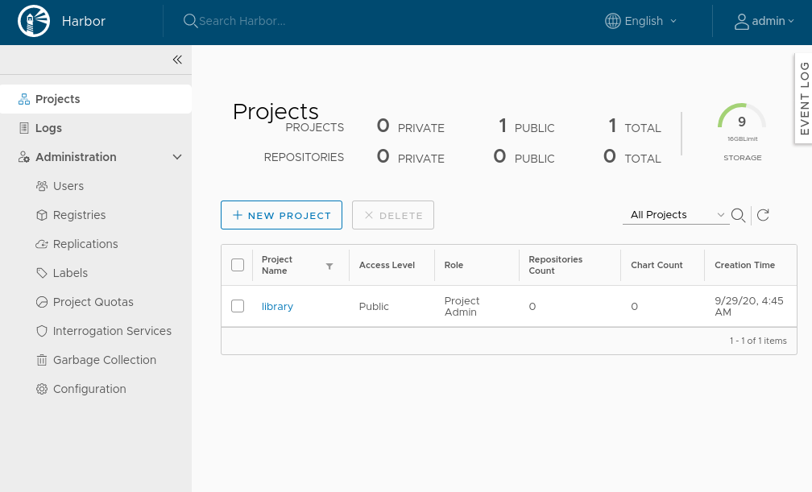
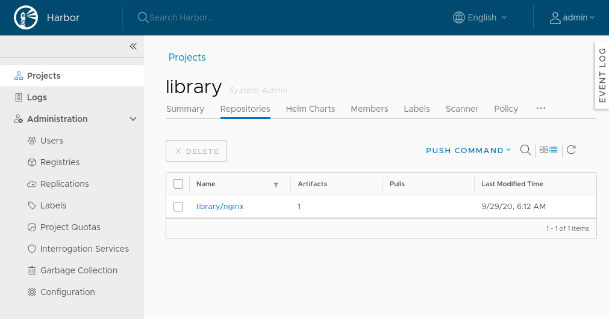

# Deploy Harbor with Helm

## Table of Contents

<!--ts-->
   * [Deploy Harbor with Helm](#deploy-harbor-with-helm)
      * [Table of Contents](#table-of-contents)
      * [About](#about)
      * [Requirements](#requirements)
      * [Terms and Abbreviations](#terms-and-abbreviations)
      * [Create a TKG Cluster](#create-a-tkg-cluster)
      * [Certificate Authority](#certificate-authority)
         * [Install mkcert](#install-mkcert)
         * [Create Certificate](#create-certificate)
      * [Deploy Harbor](#deploy-harbor)
         * [Obtain the Values File](#obtain-the-values-file)
         * [Add a Namespace](#add-a-namespace)
         * [Create a TLS Secret](#create-a-tls-secret)
         * [Edit the Values File](#edit-the-values-file)
         * [Pod Security Policies](#pod-security-policies)
         * [Deploy](#deploy)
         * [Add LoadBalancer IP to DNS](#add-loadbalancer-ip-to-dns)
         * [Login to the Harbor Web Interface](#login-to-the-harbor-web-interface)
         * [Push an Image](#push-an-image)
      * [Conclusion](#conclusion)
      * [Clean Up](#clean-up)
<!--te-->

## About

In this demo we will deploy a basic Harbor instance to a Kubernetes cluster using helm. 

The purpose of this demo is not necessarily to create a production instance of Harbor. Instead this can be used as an introduction to Harbor and Helm, and act as a starting point for building a production level helm chart. Gotta start somewhere!

**Harbor**

[Harbor](https://goharbor.io/) is an enterprise level open source container registry. It supports all the features that most enterprise oragnaizations would need to run their own conatiner image regsitry. As well, it is a Cloud Native Computing Foudnation (CNCF) graduated project.

Harbor is also much more than a simple container registry, and supports features like image signing, replication, and more.

**vSphere with Tanzu**

In this demo the Kubernetes cluster is a workload Tanzu Kubernetes Grid (TKG) cluster created by [vSphere with Tanzu](https://blogs.vmware.com/vsphere/2020/09/announcing-vsphere-with-tanzu.html), also known as vSphere with Kubernetes or the TKG service. That said, any modern Kubernetes cluster with a configured load balancer and persistent volumes will suffice.

The Kubernetes clusters that vSphere with Tanzu deploys are completely conformant Kubernetes clusters and can be used like any other Kubernetes cluster.

**Tanzu Application Catalog**

This demo also uses the [Tanzu Application Catalog](https://tanzu.vmware.com/application-catalog) Harbor helm chart, which is currently available for use as a trial, and there is no need to sign up, we can simply point helm at the trial TAC helm chart repository available to anyone.

The open source Harbor project also provides a [similar helm chart](https://github.com/goharbor/harbor-helm), but for the purposes of this demo we will pull the helm chart directly from TAC.

## Requirements

* A Kubernetes cluster with a `LoadBalancer` and persistent volumes
* A Linux, Windows WSL, or MacOS terminal to use various commands
* Helm 3 CLI installed
* Optional: `kubectx` and `kubens` installed
* `mkcert` will also be used to manage certificates
* Ability to manage DNS entries
* Docker installed to push and pull images

## Versions

* Kubernetes - 1.17
* TAC Harbor Helm chart - 7.2.0
* Harbor - 2.0.2 (deployed by helm chart)
* Helm - 3.3.0

## Terms and Abbreviations

* `kubectl` is usually aliased to `k`.

```
alias kubectl=k
```

* `kubens` and `kubectx` are often used to switch between clusters and namespaces. Also they are typically aliased to `kn` and `kc` respectively.
* `SNIP!` is used in command output to indicate some removed text.

## Create a TKG Cluster

Since we are going to deploy Harbor to a Kubernetes cluster, we actually need a Kubernets cluster.

The Tanzu Kubernetes Grid service (TKGs) has been deployed into a vSphere cluster and that will be used to create a TKG workload cluster.

*NOTE: Any Kubernetes cluster should be fine, as long as it provides a `LoadBalancer` and persistent volumes. This demo uses a "vSphere with Tanzu" based TKG workload cluster.*

*NOTE: vSphere with Tanzu/Kubernetes also has a native, integrated Harbor deployment (very easy to use, just click "Harbor Enable") but this demo will not use that option and instead, for the purposes of demonstration, deploy a completely separate Harbor deployment.*

Now we can build a TKG workload cluster by "talking Kubernetes" to the service cluster, and the way that you usually talk to Kubernetes is via, yes, you guessed it, YAML, and we'll use `kubectl` to apply that YAML.

**Create a Supervisor Namespace**

First, in vSphere, create and configure a "harbor-namespace"...er...namespace. Actually this is most easily identified as a "supervisor namespace."

```
vSphere -> Menu -> Workload Management -> New Namespace
```



The namespaces name can be anything you want, but it would have to match up with where the below YAML is installing the cluster.

Note that this "namespace" is a higher level construction, a "supervisor namespace" where VMware Administrators can configure quotas, access, storage policies, etc.

**Assign Roles and Resources**

Now that that supervisor namespace has been created, assign users, storage policies, and capacity and usage.



Once those have been created, we can deploy a TKG cluster to that supervisor namespace.

**Install the vSphere Kubectl Plugin**

If you haven't already downloaded the vSphere kubectl plugin, you can find a convenient link on the namespace page, look for "Link to CLI Tools" and click on "Open" which will bring you to this page.



Linux will be used for this demo, so the Linux CLI is installed.

**Login to the Supervisor Cluster**

Now login to the supervisor cluster.

```
$ k vsphere login --server wcp.oakwood.ave -u administrator@vsphere.local --insecure-skip-tls-verify

Password: 
Logged in successfully.

You have access to the following contexts:
   harbor-namespace
   wcp.oakwood.ave

If the context you wish to use is not in this list, you may need to try
logging in again later, or contact your cluster administrator.

To change context, use `kubectl config use-context <workload name>`
```

**Deploy a TKG Workload Cluster**

At this point we can deploy a TKG workload cluster. Below is the YAML used to define that cluster.

```
# file: harbor-cluster.yml
apiVersion: run.tanzu.vmware.com/v1alpha1
kind: TanzuKubernetesCluster                   
metadata:
  name: harbor-cluster      
  namespace: harbor-namespace                
spec:
  distribution:
    version: v1.17
  topology:
    controlPlane:
      count: 1                                 
      class: best-effort-small                   
      storageClass: kubernetes-storage-policy
    workers:
      count: 3                                 
      class: best-effort-small   
      storageClass: kubernetes-storage-policy
```

Ensure using the supervisor cluster and the harbor-namespace.

```
$ kc wcp.oakwood.ave 
✔ Switched to context "wcp.oakwood.ave".
```

```
$ kubens harbor-namespace 
✔ Active namespace is "harbor-namespace"
```

Deploy the workload cluster.

```
$ k create -f harbor-cluster.yml 
tanzukubernetescluster.run.tanzu.vmware.com/harbor-cluster created
```

As the way we are building clusters is completey through Kubernetes objects via [Cluster API] we can see things like clusters defined.

```
$ k get clusters
NAME             PHASE
harbor-cluster   provisioned
```

It'll take a few minutes for the cluster to be fully provisioned.

Once it's provisioned, the `virtualmachines` objects can be listed out.

```
$ k get virtualmachines
NAME                                            AGE
harbor-cluster-control-plane-xcg6t              49m
harbor-cluster-workers-lf27f-5566d664b6-cnn55   41m
harbor-cluster-workers-lf27f-5566d664b6-dqmt7   41m
harbor-cluster-workers-lf27f-5566d664b6-h4cv2   42m
```

As you can see above, we have a single control plane node and three worker nodes.

**Login to the Workload Cluster**

Login to that new cluster, i.e. get the credentials:

```
k vsphere login --server wcp.oakwood.ave -u administrator@vsphere.local --insecure-skip-tls-verify --tanzu-kubernetes-cluster-namespace=harbor-namespace --tanzu-kubernetes-cluster-name harbor-cluster 
```

e.g. output:

```
$ k vsphere login --server wcp.oakwood.ave -u administrator@vsphere.local --insecure-skip-tls-verify --tanzu-kubernetes-cluster-namespace=harbor-namespace --tanzu-kubernetes-cluster-name harbor-cluster 

Password: 
Logged in successfully.

You have access to the following contexts:
   harbor-cluster
   harbor-namespace
   tbs-kc
   test-namespace
   wcp.oakwood.ave

If the context you wish to use is not in this list, you may need to try
logging in again later, or contact your cluster administrator.

To change context, use `kubectl config use-context <workload name>`
```

Change the Kubernetes config context to use that cluster.

```
$ kc harbor-cluster 
✔ Switched to context "harbor-cluster".
```

## Certificate Authority

We need to provide Harbor a TLS certificate. 

### Install mkcert

To create the CA and certificates, [mkcert](https://github.com/FiloSottile/mkcert) will be used. This is an amazing piece of software for managing certificates.

*NOTE: In this demo `mkcert` and other useful binaries are installed into `~/bin`. But installing them to `/usr/local/bin` would mean the PATH won't have to be updated which could be easier.*

Download the binary.

```
wget https://github.com/FiloSottile/mkcert/releases/download/v1.4.1/mkcert-v1.4.1-linux-amd64
mv mkcert-v1.4.1-linux-amd64 mkcert
chmod +x mkcert
```

`mkcert` should now be available.

```
$ which mkcert
/home/curtis/bin/mkcert
```

Ensure `mkcert` requirements are installed.

```
sudo apt install libnss3-tools
```

Create and install the CA.

```
$ mkcert --install
Using the local CA at "/home/curtis/.local/share/mkcert" ✨
The local CA is already installed in the system trust store! 👍
The local CA is now installed in the Firefox and/or Chrome/Chromium trust store (requires browser restart)! 🦊
The local CA is already installed in Java's trust store! 👍
```

### Create Certificate

First, decide on a subdomain. By default the subdomain in the values file is `harbor.domain`. In this demo I'll use `harbor.wcp-workloads.oakwood.ave` as the subdomain, but if you are working in this in your own lab your should pick an appropriate subdomain for your situation.

Create the TLS certificates with `mkcert`.

```
$ export DOMAIN=harbor.wcp-workloads.oakwood.ave
$ mkcert harbor.$DOMAIN core.$DOMAIN notary.$DOMAIN
Using the local CA at "/home/curtis/.local/share/mkcert" ✨

Created a new certificate valid for the following names 📜
 - "harbor.harbor.wcp-workloads.oakwood.ave"
 - "core.harbor.wcp-workloads.oakwood.ave"
 - "notary.harbor.wcp-workloads.oakwood.ave"

The certificate is at "./harbor.harbor.wcp-workloads.oakwood.ave+2.pem" and the key at "./harbor.harbor.wcp-workloads.oakwood.ave+2-key.pem" ✅
```

## Deploy Harbor

The best way to deploy Harbor into a Kubernetes cluster is using a Helm chart. But then the question becomes, where do you get the helm chart?

One option is the [Tanzu Application Catalog](https://tanzu.vmware.com/application-catalog) (TAC) which provides helm charts for many open source projects, including Harbor.

At this time a demo site exists for helm charts that is available for use.

**Using the Tanzu Application Catalog**

What is the Tanzu Application Catalog (TAC)? TAC can be used to:

>Curate a catalog of production-ready open-source software from the Bitnami collection.

TAC allows organizations to have access to a large catalog of applications and open source software that they can then curate their own catalog from. Typically this is used to provide "stacks" to development teams, and is especially useful in organizations where teams are building microservices with individual stacks.

Below you can see a screenshot of TAC. The "By Type" option allows for choosing container images or helm charts as the artifact.S



And one of the helm charts available is for Harbor.



**Using TAC**

There are [good instuctions](https://docs.bitnami.com/tanzu-application-catalog/how-to/consume-tac-kubeapps/) as to how to consume TAC.

**Add the TAC Repo**

Add the TAC helm chart repo.

```
helm repo add tac https://charts.trials.tac.bitnami.com/demo 
```

That's it!

### Obtain the Values File

Download the values file.

```
helm show values tac/harbor --version 7.2.0 > values.yml
```

Now that we have the values file, we can edit it and configure it for our environment.

### Add a Namespace

Now create a namespace to deploy Harbor into.

```
k create ns harbor
```

Change to that namespace.

```
kn harbor
```

### Create a TLS Secret

Create a secret, `harbor-tls`, from the certificates that were created with `mkcert`.

First we have to convert the key to RSA format.

```
openssl rsa -in harbor.harbor.wcp-workloads.oakwood.ave+2-key.pem -out harbor.harbor.wcp-workloads.oakwood.ave+2-key.rsa
```

Now create the `harbor-tls` secret.

*NOTE: Again, note we are using the RSA version of the key, not the version that `mkcert` outputs.*

```
kubectl create secret tls harbor-tls --key harbor.harbor.wcp-workloads.oakwood.ave+2-key.rsa --cert harbor.harbor.wcp-workloads.oakwood.ave+2.pem -n harbor
```

The helm chart's values file will be configured to use that secret.

### Edit the Values File

The values file is rather large, 2000 lines, at least half of which are comments, and it can be overwhelming (just like most complex charts).

There are a few lines to edit in the values file.

* Change `harbor.domain` to your domain
* Set the name of the TLS secret
* Set the global storage policy
* OPTIONAL: Set the resource policy to not keep PVCs on delete
* OPTIONAL: Set the admin password to "admin", or something that you prefer. Otherwise helm will set a random password, which is fine too.
* OPTIONAL: Set a load balancer IP

```
$ diff values.yml values.yml.orig 
5c5
< global:
---
> # global:
9,10c9
<     storageClass: kubernetes-storage-policy
< 
---
> #   storageClass: myStorageClass
20c19
<   ## DefaharborAdminPasswordults to 'Always' if image tag is 'latest', else set to 'IfNotPresent'
---
>   ## Defaults to 'Always' if image tag is 'latest', else set to 'IfNotPresent'
386c385
<     existingSecret: 'harbor-tls'
---
>     existingSecret: ''
394c393
<     commonName: 'core.harbor.wcp-workloads.oakwood.ave'
---
>     commonName: 'core.harbor.domain'
414c413
<   loadBalancerIP: 10.0.1.5
---
>   loadBalancerIP:
426,427c425,426
<     core: core.harbor.wcp-workloads.oakwood.ave
<     notary: notary.harbor.wcp-workloads.oakwood.ave
---
>     core: core.harbor.domain
>     notary: notary.harbor.domain
457c456
< externalURL: https://core.harbor.wcp-workloads.oakwood.ave
---
> externalURL: https://core.harbor.domain
482c481
<   resourcePolicy: ''
---
>   resourcePolicy: 'keep'
619c618
< ## The log level used for Harbor # grep harbor.harbor /etc/hosts
---
> ## The log level used for Harbor services. Allowed values are [ fatal | error | warn | info | debug | trace ]
630c629
< harborAdminPassword: admin
---
> harborAdminPassword:
1028c1027
<   secretName: 'harbor-tls'
---
>   secretName: ''
```

### Pod Security Policies

The [TKG workload clusters](https://docs.vmware.com/en/VMware-vSphere/7.0/vmware-vsphere-with-kubernetes/GUID-4CCDBB85-2770-4FB8-BF0E-5146B45C9543.html) have pod security policies enabled by default, and include a default PodSecurityPolicy that you can bind to for privileged and restricted workload deployment.

*NOTE: If you are not using a TKG workload cluster, this may not apply to you.*

```
# file: harbor-rbac.yml
apiVersion: rbac.authorization.k8s.io/v1
kind: ClusterRole
metadata:
  name: psp:privileged
rules:
- apiGroups: ['policy']
  resources: ['podsecuritypolicies']
  verbs:     ['use']
  resourceNames:
  - vmware-system-privileged
---
apiVersion: rbac.authorization.k8s.io/v1
kind: ClusterRoleBinding
metadata:
  name: all:psp:privileged
roleRef:
  kind: ClusterRole
  name: psp:privileged
  apiGroup: rbac.authorization.k8s.io
subjects:
- kind: Group
  name: system:serviceaccounts
  apiGroup: rbac.authorization.k8s.io
```

Create the cluster role and role binding.

```
k create -f harbor-rbac.yml
```

### Deploy

At this point we can deploy Harbor!

```
$ helm install harbor tac/harbor --debug --version 7.2.0 -f values.yml

SNIP!
NOTES:
** Please be patient while the chart is being deployed **

1. Get the Harbor URL:

  NOTE: It may take a few minutes for the LoadBalancer IP to be available.
        Watch the status with: 'kubectl get svc --namespace harbor -w harbor'
  export SERVICE_IP=$(kubectl get svc --namespace harbor harbor --template "{{ range (index .status.loadBalancer.ingress 0) }}{{.}}{{ end }}")
  echo "Harbor URL: http://$SERVICE_IP/"

2. Login with the following credentials to see your Harbor application

  echo Username: "admin"
  echo Password: $(kubectl get secret --namespace harbor harbor-core-envvars -o jsonpath="{.data.HARBOR_ADMIN_PASSWORD}" | base64 --decode)
```

After a few minutes all the pods should be up and running.

```
$ k get pods
NAME                                    READY   STATUS    RESTARTS   AGE
harbor-chartmuseum-f46fc6ff5-vvfdv      1/1     Running   0          5m34s
harbor-clair-754b754fdc-rnbxt           2/2     Running   1          5m34s
harbor-core-7657b67dfb-gh5qk            1/1     Running   0          5m34s
harbor-jobservice-5c88c67c65-zgfsn      1/1     Running   0          5m34s
harbor-nginx-6b8d6d7f6d-cwkls           1/1     Running   0          5m34s
harbor-notary-server-759cfc689f-8wp7p   1/1     Running   0          5m34s
harbor-notary-signer-c5797d9df-rsw7l    1/1     Running   0          5m34s
harbor-portal-6fbdf56fc9-t5z2x          1/1     Running   0          5m34s
harbor-postgresql-0                     1/1     Running   0          5m34s
harbor-redis-master-0                   1/1     Running   0          5m34s
harbor-registry-79fbdf6565-49fzw        2/2     Running   0          5m34s
harbor-trivy-0                          1/1     Running   0          5m34s
```

And there should be a service with a LoadBalancer.

```
$ k get svc
NAME                         TYPE           CLUSTER-IP       EXTERNAL-IP   PORT(S)                                     AGE
harbor                       LoadBalancer   10.110.208.45    10.1.1.5      80:32543/TCP,443:31886/TCP,4443:31156/TCP   5m54s
harbor-chartmuseum           ClusterIP      10.102.14.187    <none>        80/TCP                                      5m54s
harbor-clair                 ClusterIP      10.99.64.243     <none>        6060/TCP,6061/TCP,8080/TCP                  5m54s
harbor-core                  ClusterIP      10.101.33.47     <none>        80/TCP                                      5m54s
harbor-jobservice            ClusterIP      10.103.241.194   <none>        80/TCP                                      5m54s
harbor-notary-server         ClusterIP      10.98.74.149     <none>        4443/TCP                                    5m54s
harbor-notary-signer         ClusterIP      10.107.140.160   <none>        7899/TCP                                    5m54s
harbor-portal                ClusterIP      10.105.60.15     <none>        80/TCP                                      5m54s
harbor-postgresql            ClusterIP      10.97.67.252     <none>        5432/TCP                                    5m54s
harbor-postgresql-headless   ClusterIP      None             <none>        5432/TCP                                    5m54s
harbor-redis-headless        ClusterIP      None             <none>        6379/TCP                                    5m54s
harbor-redis-master          ClusterIP      10.99.99.189     <none>        6379/TCP                                    5m54s
harbor-registry              ClusterIP      10.103.116.156   <none>        5000/TCP,8080/TCP                           5m54s
harbor-trivy                 ClusterIP      10.102.21.1      <none>        8080/TCP                                    5m54s
```

or:

```
$ k get svc harbor
NAME     TYPE           CLUSTER-IP      EXTERNAL-IP   PORT(S)                                     AGE
harbor   LoadBalancer   10.110.208.45   10.1.1.5      80:32543/TCP,443:31886/TCP,4443:31156/TCP   6m10s
```

### Add LoadBalancer IP to DNS

Now ensure the DNS name you gave the harbor service resolves.

In my case I'm simply using DNSmasq as my DNS server, and I've configured the below. Your DNS server or `/etc/hosts` will be different, but the same entries should be made.

```
$ grep harbor.wcp-workloads /etc/hosts
10.1.1.5 harbor.harbor.wcp-workloads.oakwood.ave
10.1.1.5 core.harbor.wcp-workloads.oakwood.ave
10.1.1.5 notary.harbor.wcp-workloads.oakwood.ave
```

### Login to the Harbor Web Interface

Access the Harbor domain name that was configured via https.

```
Login: admin
Password: admin
```

*NOTE: This assumes you changed it in the values file.*



### Push an Image

First, login to harbor with Docker.

*NOTE: This assumes the CA has been installed into where ever you are running docker from. In this demo example, docker is running on the same Linux node as where `mkcert` was installed and run.*

```
$ docker login harbor.harbor.wcp-workloads.oakwood.ave
Username: admin
Password: 
WARNING! Your password will be stored unencrypted in /home/curtis/.docker/config.json.
Configure a credential helper to remove this warning. See
https://docs.docker.com/engine/reference/commandline/login/#credentials-store

Login Succeeded
```

Let's pull a nginx image.

```
$ docker pull nginx
Using default tag: latest
latest: Pulling from library/nginx
d121f8d1c412: Pull complete 
ebd81fc8c071: Pull complete 
655316c160af: Pull complete 
d15953c0e0f8: Pull complete 
2ee525c5c3cc: Pull complete 
Digest: sha256:c628b67d21744fce822d22fdcc0389f6bd763daac23a6b77147d0712ea7102d0
Status: Downloaded newer image for nginx:latest
docker.io/library/nginx:latest
```

Tag that image so we can push it to the Harbor we just installed.

```
$ docker tag nginx harbor.harbor.wcp-workloads.oakwood.ave/library/nginx
```

Push it.

```
$ docker push harbor.harbor.wcp-workloads.oakwood.ave/library/nginx
The push refers to repository [harbor.harbor.wcp-workloads.oakwood.ave/library/nginx]
908cf8238301: Pushed 
eabfa4cd2d12: Pushed 
60c688e8765e: Pushed 
f431d0917d41: Pushed 
07cab4339852: Pushed 
latest: digest: sha256:794275d96b4ab96eeb954728a7bf11156570e8372ecd5ed0cbc7280313a27d19 size: 1362
```

By default harbor is configured with a project called `library` which is where we pushed the image. Harbor supports creating multiple projects.

In the Harbor GUI, the nginx repository should now be visible.



## Conclusion

At this point a fully usable Harbor instance has been deployed to Kubernetes via helm, and images can be pushed to it. It's amazing what you can do with a helm chart and a few variables!

It's important to note that in order to use this registry from a Kubernetes cluster the cluster nodes would have to have the Certificate Authority installed. 

## Clean Up

Ensure you are in the right cluster and namespace before deleting anything!

*NOTE: The helm values in this demo are set so that persistent volumes will NOT be kept after `helm delete`.*

```
helm delete harbor 
for i in `k get pvc | grep -v NAME | tr -s " " | cut -f 1 -d " "`; do k delete pvc $i; done
```

In vSphere, remove the `harbor-namespace` supervisor namespace. Of course this will delete the entire cluster that was created!

Also remove the local docker images that were used, if any.